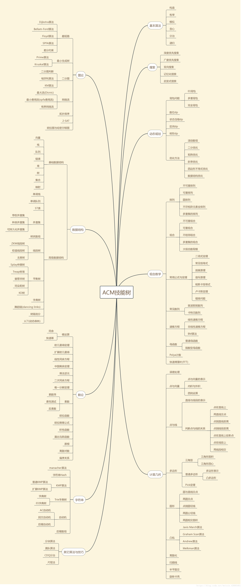

#   ACM模板

>Author：Sylvie233
>
>Date：2022/07/13


[TOC]




## 基础工具


## 一、图论

### 最短路

#### 1.dijkstra（单源最短路）

```c++
/**
 * @brief dijkstra单源最短路 
 *  数据范围：0~n-1
 * 
 */
int n;
int cost[N][N], d[N];
bool used[N];

void dijkstra(int s) {
    std::fill(d, d + n, INF);
    std::fill(used, used + n, false);
    d[s] = 0;
    while (true) {
        int v = -1;
        for (int w = 0; w < n; w++) {
            if (!used[w] && (v == -1 || d[w] < d[v])) {
                v = w;
            }
        }
        if (v == -1) {
            break;
        }
        used[v] = true;
        for (int w = 0; w < n; w++) {
            d[w] = std::min(d[w], d[v] + cost[v][w]);
        }
    }
}
```


#### 2.dijkstra（单源最短路，优先队列优化）

```c++
/**
 * @brief dijkstra单源最短路 （优先队列优化）
 *  数据范围：0~n-1
 * 
 */
struct edge {
    int to, cost;
};
int n, d[N];
std::vector<edge> G[N];

void dijkstra(int s) {
    std::priority_queue<P, std::vector<P>, std::greater<P>> que;
    std::fill(d, d + n, INF);
    d[s] = 0;
    que.push(P(0, s));
    while (!que.empty()) {
        P p = que.top();
        que.pop();
        int v = p.second;
        if (d[v] < p.first) {
            continue;
        }
        for (int i = 0; i < G[v].size(); i++) {
            edge e = G[v][i];
            if (d[e.to] > d[v] + e.cost) {
                d[e.to] = d[v] + e.cost;
                que.push(P(d[e.to], e.to));
            }
        }
    }
}
```


### 最小生成树

#### 1.kruskal

```c++
/**
 * @brief kruskal（并查集）
 *  数据范围：0~n、0~m-1
 * 
 */
struct edge {
    int v, w, cost;
};
edge es[N];
int n, m;
int par[N], rk[N];

void init() {
    for (int i = 0; i < n; i++) {
        par[i] = i;
        rk[i] = 0;
    }
}

int find(int x) {
    if (par[x] == x) {
        return x;
    }
    return par[x] = find(par[x]);
}

void unite(int x, int y) {
    x = find(x);
    y = find(y);
    if (x == y) {
        return;
    }
    if (rk[x] < rk[y]) {
        par[x] = y;
    } else {
        par[y] = x;
        if (rk[x] == rk[y]) {
            rk[x]++;
        }
    }
}

bool same(int x, int y) {
    return find(x) == find(y);
}

int kruskal() {
    std::sort(es, es + m, [](edge a, edge b) {
        return a.cost < b.cost;
    });
    init();
    int res = 0;
    for (int i = 0; i < m; i++) {
        edge e = es[i];
        if (!same(e.v, e.w)) {
            unite(e.v, e.w);
            res += e.cost;
        }
    }
    return res;
}
```


### 二分图

#### 1.二分图匹配（最大匹配数）

```c++
/**
 * @brief 二分图匹配（最大匹配数）
 *  数据范围：1~n、1~m
 * 
 */
int n, m;
bool used[N];
int match[N], G[N][N];

int find(int x) {
    for (int i = 1; i <= m; i++) {
        if (!used[i] && G[x][i]) {
            used[i] = true;
            if (!match[i] || find(match[i])) {
                match[i] = x;
                return 1;
            }
        }
    }
    return 0;
}

int solve() {
    int res = 0;
    for (int i = 1; i <= n; i++) {
        std::memset(used, 0, sizeof(used));
        if (find(i)) {
            res++;
        }
    }
    return res;
}
```


### Tarjin（强连通分量分解、缩点）

```c++
/**
 * @brief Tarjin（强连通分量分解、缩点）
 * 数据范围：0~m-1、0~n-1
 */
struct {
    int v, next;
} edge[N];
int cnt, head[N];
int top, flag, tot, sta[N], dfn[N], low[N], id[N];
bool used[N];

void add_edge(int u, int v) {
    edge[cnt].v = v;
    edge[cnt].next = head[u];
    head[u] = cnt++;
}

void init() {
    cnt = top = flag = tot = 0;
    std::memset(head, -1, sizeof(head));
    std::memset(dfn, 0, sizeof(dfn));
    std::memset(used, 0, sizeof(used));
}

void tarjin(int u) {
    dfn[u] = low[u] = ++flag;
    used[u] = true;
    sta[top++] = u;
    for (int i = head[u]; i != -1; i = edge[i].next) {
        int v = edge[i].v;
        if (!dfn[v]) {
            tarjin(v);
            low[u] = std::min(low[u], low[v]);
        } else if (used[v]) {
            low[u] = std::min(low[u], dfn[v]);
        }
    }
    if (dfn[u] == low[u]) {
        tot++;
        int t;
        do {
            t = sta[--top];
            used[t] = false;
            id[t] = tot;
        } while(t != u);
    }
}

void solve() {
    int n, m, u, v; // 删除
    init();
    for (int i = 0; i < m; i++) {
        add_edge(u, v);
    }
    for (int i = 1; i <= n; i++) {
        if (!dfn[i]) {
            tarjin(i);
        }
    }
}
```


## 二、数据结构

### 手写堆

```c++
/**
 * @brief 小顶堆
 *  索引范围：1~n-1，n为当前剩余空位，左右索引[index*2+1, index*2]
 *  堆顶：hp[0]
 */
int hp[N], n = 0;

void push(int x) {
    int index = n++;
    while (index > 0) {
        int p = (index - 1) / 2;
        if (hp[p] <= x) {
            break;
        }
        hp[index] = hp[p];
        index = p;
    }
    hp[index] = x;
}

int pop() {
    int ret = hp[0], x = hp[--n], index = 0;
    while (index * 2 + 1 < n) {
        int left = index * 2 + 1, right = index * 2 + 2;
        if (right < n && hp[right] < hp[left]) {
            left = right;
        }
        if (hp[left] >= x) {
            break;
        }
        hp[index] = hp[left];
        index = left;
    }
    hp[index] = x;
    return ret;
} 
```


### 单调栈（柱形图包含的长方形的最大面积）

```c++
/**
 * @brief 单调栈（柱形图包含的长方形的最大面积）
 *  数据范围：1~n
 */
int n, h[N], l[N], r[N];

int solve() {
    std::stack<int> sta;
    for (int i = 1; i <= n; i++) {
        while (!sta.empty() && h[sta.top()] >= h[i]) {
            sta.pop();
        }
        l[i] = sta.empty() ? 1 : sta.top() + 1;
        sta.push(i);
    }
    std::stack<int> sta2;
    for (int i = n; i >= 1; i++) {
        while (!sta2.empty() && h[sta2.top()] >= h[i]) {
            sta2.pop();
        }
        r[i] = sta2.empty() ? n : sta2.top() - 1;
        sta2.push(i);
    }
    int res = 0;
    for (int i = 1; i <= n; i++) {
        res = std::max(res, (r[i] - l[i] + 1) * h[i]);
    }
    return res;
}
```


### 单调队列（固定长度区间最大、小值）

```c++
/**
 * @brief 单调队列求固定长度区间最大、小值
 *  索引范围：1~n，长度：k
 *  mx[]、mn[]的索引范围：[1,n-k+1]
 * 
 */
int n, k, d[N], mn[N], mx[N];
std::deque<int> dq;

void clear(std::deque<int>& dq) {
    std::deque<int> empty;
    std::swap(empty, dq);
}

void solve() {
    for (int i = 1; i <= n; i++) {
        while (!dq.empty() && d[dq.back()] >= d[i]) {
            dq.pop_back();
        }
        dq.push_back(i);
        if (i - k + 1 > 0) {
            mn[i - k + 1] = d[dq.front()];
            if (dq.front() == i - k + 1) {
                dq.pop_front();
            }
        }
    }
    clear(dq);
    for (int i = 1; i <= n; i++) {
        while (!dq.empty() && d[dq.back()] <= d[i]) {
            dq.pop_back();
        }
        dq.push_back(i);
        if (i - k + 1 > 0) {
            mx[i -k + 1] = d[dq.front()];
            if (dq.front() == i - k + 1) {
                dq.pop_front();
            }
        }
    }
}
```


### 并查集

```c++
/**
 * @brief 并查集
 *  带高度优化
 *  数据范围：1~n-1
 * 
 */
int n, par[N], rk[N];

void init() {
    for (int i = 0; i < n; i++) {
        par[i] = i;
        rk[i] = 0;
    }
}

int find(int x) {
    if (par[x] == x) {
        return x;
    }
    return par[x] = find(par[x]);
}

void unite(int x, int y) {
    x = find(x);
    y = find(y);
    if (x == y) {
        return;
    }
    if (rk[x] < rk[y]) {
        par[x] = y;
    } else {
        par[y] = x;
        if (rk[x] == rk[y]) {
            rk[x]++;
        }
    }
}

bool same(int x, int y) {
    return find(x) == find(y);
}
```


### ST表（区间最大、小值查询，不能更新）

```c++
/**
 * @brief ST表（区间最大、小值查询，不能更新）
 * 区间范围：1~n，2^21=2e6
 */
int n, d[N], mx[N][22], mn[N][22];

int get_max(int l, int r) {
    int k = std::log2(r - l + 1);
    return std::max(mx[l][k], mx[r - (1 << k) + 1][k]);
}

int get_min(int l, int r) {
    int k = std::log2(r - l + 1);
    return std::min(mn[l][k], mn[r - (1 << k) + 1][k]);
}

void init() {
    for (int i = 1; i <= n; i++) {
        mx[i][0] = mn[i][0] = d[i]; 
    }
    for (int j = 1; j <= 21; j++) {
        for (int i = 1; i + (1 << j) - 1 <= n; i++) {
            mx[i][j] = std::max(mx[i][j - 1], mx[i + (1 << (j - 1))][j - 1]);
            mn[i][j] = std::min(mn[i][j - 1], mn[i + (1 << (j - 1))][j - 1]);
        }
    }
}
```


### 树状数组

#### 1.单点更新，区间求和

```c++
/**
 * @brief 树状数组（单点更新，区间求和）
 *  数据范围：1~n 
 * 
 */
int n, arr[N], bit[N];

int sum(int i) {
    int res = 0;
    while (i > 0) {
        res += bit[i];
        i -= i & -i;
    }
}

void add(int i, int v) {
    while (i <= n) {
        bit[i] += v;
        i += i & -i;
    }
}

void init() {
    for (int i = 1; i <= n; i++) {
        add(i, arr[i]);
    }
}
```


#### 2.区间更新，单点查询

```c++
/**
 * @brief 树状数组（区间更新，单点查询）
 *  数据范围：1~n
 * 
 */
int n, arr[N], bit[N];

int sum(int i) {
    int res = 0;
    while (i > 0) {
        res += bit[i];
        i -= i & -i;
    }
}

void add(int i, int v) {
    while (i <= n) {
        bit[i] += v;
        i += i & -i;
    }
}

void update(int l, int r, int v) {
    add(l, v);
    add(r + 1, -v);
}

void init() {
    for (int i = 1; i <= n; i++) {
        add(i, arr[i] - arr[i - 1]);
    }
}
```


#### 3.区间更新，区间查询

```c++
/**
 * @brief 树状数组（区间更新，区间查询）
 *  数据范围：1~n，bit[i][0]为公式前面，bit[i][1]为公式后面
 *     arr[1~3]：
 *        (3+1)*(c[1]+c[2]+c[3])-(1*c[1]+2*c[2]+3*c[3])
 * 
 */
int n, arr[N], bit[N][2];

int sum(int i, int f) {
    int res = 0;
    while (i > 0) {
        res += bit[i][f];
        i -= i & -i;
    }
}

void add(int i, int v, int f) {
    while (i <= n) {
        bit[i][f] += v;
        i += i & -i;
    }
}

void update(int l, int r, int v) {
    add(l, v, 0);
    add(r + 1, -v, 0);
    add(l, l * v, 1);
    add(r + 1, (r + 1) * -v, 1);
}

int query(int i) {
    return (i + 1) * sum(i, 0) - sum(i, 1);
}

void init() {
    for (int i = 1; i <= n; i++) {
        add(i, arr[i] - arr[i - 1], 0);
        add(i, i * (arr[i] - arr[i - 1]), 1);
    }
}
```


#### 4.单点更新，区间最值

```c++
/**
 * @brief 树状数组（单点更新，区间最值）
 *  数据范围：1~n，这里算的是max，最小值只需把max换成min即可
 *     7(111)   6(110)      4(100)
 *              5(101)   2(010) 3(101)
 *                       1(001)
 */
int n, arr[N], bit[N];

void update(int i) {
    while (i <= n) {
        bit[i] = arr[i];
        int x = i & -i;
        for (int j = 1; j < x; j++) {
            bit[i] = std::max(bit[i], bit[i - j]);
        }
    }
}

int query(int l, int r) {
    int res = 0;
    while (r >= l) {
        res = std::max(res, arr[r]);
        r--;
        while (r - (r & -r) >= l) {
            res = std::max(res, bit[r]);
            r -= r & -r;
        }
    }
    return res;
}

void init() {
    for (int i = 1; i <= n; i++) {
        update(i);
    }
    // 更新arr[1]
    arr[1] = 100;
    update(1);
}
```


### 线段树

#### 1.单点更新，区间查询

```c++
/**
 * @brief 线段树（单点更新，区间查询）
 *  数据范围：1~n，根标号：1，左节点标号:i<<1，右节点标号：(i<<1)|1
 *                        1[1~5]
 *               2[1~3]              3[4~5]
 *         4[1~2]     5[3~3]      6[4~4] 7[5~5]
 *     8[1~1] 9[2~2]  
 *  
 */ 
struct node {
    int l, r, sum, mx;
};
int n, arr[N];
node seg[N << 2];

void pushup(int i) {
    seg[i].sum = seg[i << 1].sum + seg[(i << 1) | 1].sum;
    seg[i].mx = std::max(seg[i << 1].mx, seg[(i << 1) | 1].mx);
}

void build(int i, int l, int r) {
    seg[i].l = l;
    seg[i].r = r;
    if (l == r) {
        seg[i].sum = arr[l];
        seg[i].mx = arr[l];
        return;
    }
    int mid = (l + r) / 2;
    build(i << 1, l, mid);
    build((i << 1) | 1, mid + 1, r);
    pushup(i);
}

int get_sum(int i, int l, int r) {
    if (seg[i].l == l && seg[i].r == r) {
        return seg[i].sum;
    }
    int mid = (seg[i].l + seg[i].r) /2;
    if (r <= mid) {
        return get_sum(i << 1, l, r);
    } else if (l > mid) {
        return get_sum((i << 1) | 1, l, r);
    }
    return get_sum(i << 1, l, mid) + get_sum((i << 1) | 1, mid + 1, r);
}

int get_max(int i, int l, int r) {
    if (seg[i].l == l && seg[i].r == r) {
        return seg[i].mx;
    }
    int mid = (seg[i].l + seg[i].r) /2;
    if (r <= mid) {
        return get_max(i << 1, l, r);
    } else if (l > mid) {
        return get_max((i << 1) | 1, l, r);
    }
    return std::max(get_max(i << 1, l, mid), get_max((i << 1) | 1, mid + 1, r));
}

void add(int i, int k, int v) {
    if (seg[i].l == k && seg[i].r == k) {
        seg[i].sum += v;
        seg[i].mx += v;
        return;
    }
    int mid = (seg[i].l + seg[i].r) / 2;
    if (k <= mid) {
        add(i << 1, k, v);
    } else {
        add((i << 1) | 1, k, v);
    }
    pushup(i);
}

void solve() {
    build(1, 1, n);
}
```


#### 2.区间更新，区间查询

```c++
/**
 * @brief 线段树（区间更新，区间查询）
 *  数据范围：1~n，根标号：1，左节点标号:i<<1，右节点标号：(i<<1)|1
 *                        1[1~5]
 *               2[1~3]              3[4~5]
 *         4[1~2]     5[3~3]      6[4~4] 7[5~5]
 *     8[1~1] 9[2~2]  
 *  
 */ 
struct node {
    int l, r, sum;
};
int arr[N], lz[N << 2];
node seg[N << 2];

void pushdown(int rt, int m) {
    if (lz[rt]) {
        lz[rt << 1] += lz[rt];
        lz[(rt << 1) | 1] += lz[rt];
        seg[rt << 1].sum += lz[rt] * (m - (m >> 1));
        seg[(rt << 1) | 1].sum += lz[rt] * (m >> 1);
        lz[rt] = 0;
    }
}

void pushup(int rt) {
    seg[rt].sum = seg[rt << 1].sum + seg[(rt << 1) | 1].sum;
}

void build(int l, int r, int rt) {
    seg[rt].l = l;
    seg[rt].r = r;
    lz[rt] = 0;
    if (l == r) {
        seg[rt].sum = arr[l];
        return;
    }
    int mid = (l + r) >> 1;
    build(l, mid, rt << 1);
    build(mid + 1, r, (rt << 1) | 1);
    pushup(rt);
}

int query(int l, int r, int rt) {
    if (seg[rt].l == l && seg[rt].r == r) {
        return seg[rt].sum;
    }
    int mid = (seg[rt].l + seg[rt].r) >> 1;
    pushdown(rt, seg[rt].r - seg[rt].l + 1);
    if (r <= mid) {
        return query(l, r, rt << 1);
    } else if (l > mid) {
        return query(l, r, (rt << 1) | 1);
    }
    return query(l, mid, rt << 1) + query(mid + 1, r, (rt << 1) | 1);
}

void update(int v, int l, int r, int rt) {
    if (seg[rt].l == l && seg[rt].r == r) {
        lz[rt] += v;
        seg[rt].sum += v * (r - l + 1);
        return;
    }
    if (seg[rt].l == seg[rt].r) {
        return;
    }
    int mid = (seg[rt].l + seg[rt].r) >> 1;
    pushdown(rt, seg[rt].r - seg[rt].l + 1);
    if (r <= mid) {
        update(v, l, r, rt << 1);
    } else if (l > mid) {
        update(v, l, r, (rt << 1) | 1);
    } else {
        update(v, l, mid, rt << 1);
        update(v, mid + 1, r, (rt << 1) | 1);
    }
    pushup(rt);
}
```


## 三、数论

### 快速幂

```c++
typedef long long ll;

ll qpow(ll a, ll b) {
    ll res = 1;
    while (b) {
        if (b & 1) {
            res *= a;
        }
        a *= a;
        b >>= 1;
    }
    return res;
}

ll qpow(ll a, ll b, ll mod) {
    ll res = 1;
    a %= mod;
    while (b) {
        if (b & 1) {
            res = res * a % mod;
        }
        a = a * a % mod;
        b >>= 1;
    }
    return res;
}
```


### 欧几里得定理

```c++
/**
 * @brief 欧几里得定理
 *  a=kb+r
 */

int gcd(int a, int b) {
    return b ? gcd(b, a % b) : a;
}

```


### 扩展欧几里得定理

```c++
/**
 * @brief 欧几里得定理
 *  ax+by=gcd(a,b)=gcd(b,a%b)=b*x0+(a%b)*y0
 *      x0,y0为下层的值
 *  ax+by=a*y0+b*(x0-[a/b]*y0)，已递归求出下层的x0，y0，
 *  反过来求当前层的x，y：x=y0，y=x0-[a/b]*y0
 */
int exgcd(int a, int b, int& x, int& y) {
    int res = a;
    if (b) {
        res = exgcd(b, a % b, y, x);
        y -= (a / b) * x;
    } else {
        x = 1;
        y = 0;
    }
    return res;
}
```


## 四、字符串

### Manacher（最大回文子串：回文半径） 

```c++
/**
 * @brief Manacher（最大回文子串：回文半径） 
 *  数据范围：N为字符串长度的两倍，
 *      p为当前mx最远的回文串的中心 
 */
int Len[N];

int manacher(std::string s) {
    std::string t;
    t += "^";
    t += "#";
    for (int i = 0; i < s.size(); i++) {
        t += s[i];
        t += "#";
    }
    t += "$";
    int len = t.size(), p = 0, mx = 0, res = 0;
    for (int i = 1; i <= len - 2; i++) {
        Len[i] = mx > i ? std::min(Len[2 * p - i], mx - i) : 1;
        while (t[i + Len[i]] == t[i - Len[i]]) {
            Len[i]++;
        }
        if (i + Len[i] > mx) {
            mx = i + Len[i];
            p = i;
        }
        res = std::max(res, Len[i] - 1);
    }
    return res;
}
```


### 普通kmp

```c++
/**
 * @brief kmp（字符串匹配、个数统计）
 *  数据范围：1~n-1
 */
int next[N];

void get_next(char* T) {
    int i = 0, j = -1, len = std::strlen(T);
    next[0] = -1;
    while (i < len) {
        if (j == -1 || T[i] == T[j]) {
            next[++i] = ++j;
        } else {
            j = next[j];
        }
    }
}

int kmp_index(char* S, char* T) {
    int i = 0, j = 0, len_s = std::strlen(S), len_t = std::strlen(T);
    get_next(T);
    while (i < len_s && j < len_t) {
        if (j == -1 || S[i] == T[j]) {
            i++;
            j++;
        } else {
            j = next[j];
        }
    }
    if (j == len_t) {
        return i - len_t;
    }
    return -1;
}

int kmp_count(char* S, char* T) {
    int res = 0, len_s = std::strlen(S), len_t = std::strlen(T);
    if (len_s == 1 && len_t == 1) {
        if (S[0] == T[0]) {
            return 1;
        } else {
            return 0;
        }
    }
    get_next(T);
    for (int i = 0, j = 0; i < len_s; i++) {
        while (j > 0 && S[i] != T[j]) {
            j = next[j];
        }
        if (S[i] == T[j]) {
            j++;
        }
        if (j == len_t) {
            res++;
            j = next[j];
        }
        return res;
    }
}
```


### 扩展kmp（后缀匹配前缀）

```c++
/**
 * @brief 扩展kmp（后缀匹配前缀）
 *  数据范围：0~n-1
 */
int next[N], extend[N];

void get_next(std::string t) {
    int p = 0, len = t.size();
    next[0] = len;
    while (p + 1 < len && t[p] == t[p + 1]) {
        p++;
    }
    next[1] = p;
    p = 1;
    for (int i = 2; i < len; i++) {
        if (i + next[i - p] < p + next[p]) {
            next[i] = next[i - p];
        } else {
            int j = p + next[p] - i > 0 ? p + next[p] - i : 0;
            while (i + j < len && t[j] == t[i + j]) {
                j++;
            }
            next[i] = j;
            p = i;
        }
    }
}

void get_extend(std::string s, std::string t) {
    int p = 0, i = 0, len_s = s.size(), len_t = t.size();
    get_next(t);
    while (i < len_s && i < len_t && s[i] == t[i]) {
        i++;
    }
    extend[0] = i;
    p = 0;
    for (i = 1; i < len_s; i++) {
        if (i + next[i - p] < p + extend[p]) {
            extend[i] = next[i - p];
        } else {
            int j = p + extend[p] - i > 0 ? p + extend[p] - i : 0;
            while (i + j < len_s && j < len_t && t[j] == s[i + j]) {
                j++;
            }
            extend[i] = j;
            p = i;
        }
    }
}
```


## 五、其它算法


## 六、基础算法


## 七、搜索


## 八、动态规划

### 背包问题

#### 1.01背包

```c++
for (int i = 0; i < n; i++) {
    for (int j = m; j >= w[i]; j--) {
        dp[j] = std::max(dp[j], dp[j - w[i]] + v[i]);
    }
}
```


#### 2.完全背包

```c++
for (int i = 0; i <= n; i++) {
    for (int j = w[i]; j <= m; j++) {
        dp[j] = std::max(dp[j], dp[j - w[i]] + v[i]);
    }
}
```


#### 3.多重背包

```c++
for (int i = 0; i < n; i++) {
    for (int j = m; j >= w[i]; j--) {
        for (int k = 1; k <= c[i] && j >= k * w[i]; k++) {
            dp[j] = std::max(dp[j], dp[j - k * w[i]] + k * [i]);
        }
    }
}
```


### 最长子序列问题

#### 1.最长公共子序列

```c++
for (int i = 0; i < n; i++) {
    for (int j = 0; j < m; j++) {
        if (s[i] == t[j]) {
            dp[i + 1][j + 1] = dp[i][j] + 1;
        } else {
            dp[i + 1][j + 1] = std::max(dp[i + 1][j], dp[i][j + 1]);
        }
    }
}
```


#### 2.最长上升子序列

```c++
int res = 0;
for (int i = 0; i < n; i++) {
    dp[i] = 1;
    for (int j = 0; j < i; j++) {
        if (a[j] < a[i]) {
            dp[i] = std::max(d[i], dp[j] + 1);
        }
        res = std::max(res, dp[i]);
    }
}
```


## 九、组合数学


## 十、计算几何