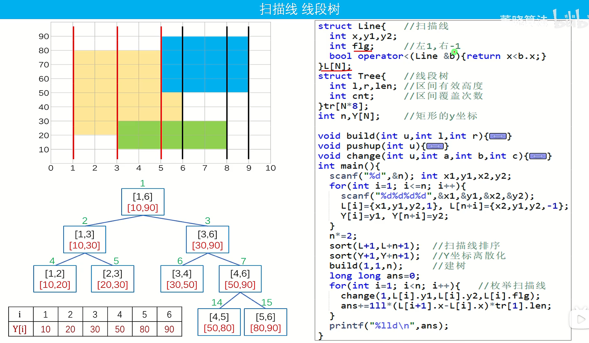

# ACM算法(4+4+1)

> Author: Sylvie233
>
> DateL: 23/5/27

[TOC]

## 图论

### 搜索

#### 深度优先搜索


#### 广度优先搜索


#### 记忆化搜索


#### 双向宽搜


#### A*


#### IDA*


#### 模拟退火


### 拓扑排序


### 连通性问题

#### 强连通分量

##### 强连通分支及其缩点


#### 双连通分量


#### 图的割边和割点

##### 最小割


##### 网络流规约


#### 2-SAT


### Tarjan


### 最小生成树

#### 次小生成树


#### k小生成树


#### 最优比例生成树


### 最短路

#### 第k短路径


#### 差分约束


### 网络流

#### 最大流


#### 最小割


### 二分图匹配

#### 匈牙利算法


#### KM算法


#### 最大独立集


### 欧拉回路


### 哈密顿回路


### 最小生成森林


### 稳定婚姻


### 仙人掌


### 带花树


### 斯坦纳树


### 支配树


### 基环树

#### 基环外向树


### 对偶图


### 最大团


### 树分治


## 数据结构

### 分块


### 链式前向星


### bitset


### 栈

#### 单调栈


### 队列

#### 优先队列


#### 双端队列


#### 单调队列


### 堆


### 分治

#### CDQ分治


### 树

#### 基环树


#### 二叉树


#### 二叉搜索树


#### 平衡树


#### 左偏树


### 线段树

#### 离散线段树


#### 扫描线

```
#include <iostream>
#include <algorithm>

const int N = 1e7 + 5;

using ll = long long;

struct Line{
    int x, y1, y2;
    int flg; // 左1，右-1
    bool operator<(Line& b) {
        return x < b.x;
    }
} L[N * 2];

struct Tree {
    int l, r, len; // 区间有效高度
    int cnt;
} tr[N * 8];

int n, Y[N * 2];

void build (int u, int l, int r) {
     tr[u].l = Y[l];
     tr[u].r = Y[r];
     if (r == l + 1) return; // 叶子宽度为2
     int mid = (l + r) >> 1;
     build(u << 1, l, mid);
     build((u << 1) | 1, mid, r);
}

void pushup(int u) {
    if (tr[u].cnt) { // 第u号区间被完全覆盖
        tr[u].len = tr[u].r - tr[u].l;
    } else {    // 第u号区间未完全覆盖
        tr[u].len = tr[u << 1].len + tr[u << 1 | 1].len;
    }
}

void change(int u, int a, int b, int c) {
    if (a >= tr[u].r || b <= tr[u].l) return;
    if (a <= tr[u].l && tr[u].r <= b) {
        tr[u].cnt += c;
        pushup(u);
        return;
    }
    change(u << 1, a, b, c);
    change(u << 1 | 1, a, b, c);
    pushup(u);
}

int main() {
    std::cin >> n;
    int x1, x2, y1, y2;
    for (int i = 1; i <= n; i++) {
        std::cin >> x1 >> y1 >> x2 >> y2;
        L[i] = { x1, y1, y2, 1};
        L[n + i] = { x2, y1, y2, -1};
        Y[i] = y1;
        Y[n + i] = y2;
    }
    n *= 2;
    std::sort(L + 1, L + n + 1); // 按照x从小到大排序
    std::sort(Y + 1, Y + 1 + n);
    build(1, 1, n); // Y中n的个数还可优化
    ll ans = 0;
    for (int i = 1; i < n; i++) {
        change(1, L[i].y1, L[i].y2, L[i].flg);
        ans += 1ll * (L[i + 1].x - L[i].x) * tr[1].len;
    }
    std::cout << ans << '\n';
    return 0;
}
```





区间有效高度思想


#### zkw线段树


#### 线段树合并


### 李超树


### 主席树


### 树状数组


### 树链剖分


### 字典树

#### 可持续化字典树


### 并查集


#### 带权并查集


#### 可持续化并查集


### Splay

#### Treap

#### FHQ Treap


### LCT


### 替罪羊树


### 莫队

#### 带修莫队


### 树套树


### 舞蹈链


### 笛卡尔树


### 猫树


### KD树


## 数论

### 快速幂


### 贝祖定理


### 欧几里得

```
int gcd(int a, int b) {
	if (0 == b) return a;
	return gcd(b, a % b);
}
```


#### 类欧几里得


#### 扩展欧几里得


### 母函数


### 泰勒展开


### 康托展开


### 同余运算

#### 指数同余方程


#### 高次同余方程


### 模运算

#### 组合数取模


### 二次剩余


### 威尔逊定理


### 欧拉定理


### 中国剩余定理

#### 扩展中国剩余定理


### 素性测试


### 素数筛

#### 埃氏筛


#### 线性欧拉筛


#### 杜教筛


#### Min25筛


#### 洲阁筛


### Miller-Rabin素数测试


### Pollard-Rho大数分解


### 素数密度定理


### 唯一分解定理


### BSGS

#### EXBSGS


### 原根


### 费马小定理


### 卢卡斯定理


### 积性函数

#### 积性函数前缀和


### 欧拉函数


### 莫比乌斯函数

#### 莫比乌斯反演


### 迪利克雷卷积


### 整除分块


### FFT

#### NTT


#### FWT


#### 生成函数


### 线性基


### 高斯消元


## 字符串

### 字典树


### KMP

#### 扩展KMP


### 哈希


### 后缀自动机

#### 广义后缀自动机


### 马拉车


### AC自动机


### 回文自动机


### 后缀数组


### Lyndon分解


### BM算法


## 动态规划

### 一般DP

#### LCS

##### 最长公共子序列


 


##### 最长公共子串


#### 编辑距离


  


滚动数组优化


### 背包问题

#### 01背包


#### 完全背包


### 区间DP


### 状态压缩DP


### 数位DP


### 树形DP


### 概率DP


### 插头DP


### SOSDP


### DP优化


## 组合数学

### 排列

#### 多重集和排列


### 组合

#### 多重集的组合


#### 组合数公式


### 二项式定理


### 鸽巢原理


### 容斥原理


### 错排问题


### 特殊计数

#### 斐波那契数列


#### 第一类斯特林数


#### 第二类斯特林树


### 生成函数


### 线性递推方程

#### 非线性递推方程


### Burnside定理


### Polya计数


## 计算几何

### 最远曼哈顿距离


### 最小包围圆

#### 最小包围球


### 最远点对

#### 旋转卡壳


#### 最近点对


#### 最近圆对


### 费马点


### 圆交点

#### 圆的面积交


### 平面面积最大三角


### Pick定理


### 多边形面积

#### 重心


### 多边形判核


### 模拟退火


### 定长圆覆盖最多的点


### 不等大的圆的圆弧表示


### 矩形面积并

#### 矩形的周长并


### 圆的反演变换


## 博弈论

### 巴什博弈


### 威佐夫博弈


### Nim博弈


### SG函数


### 斐波那契博弈


### 其它博弈


## 其它

### 排序

#### 冒泡排序


#### 选择排序


#### 快速排序


#### 堆排序


#### 桶排序


#### 归并排序


#### 插入排序


### 贪心


### 尺取


### 前缀和


### 滚动数组


### 差分


### 二分

#### 三分


### 扫描线


### 高精度


### 倍增


### 构造


### 交互


### 快读


### 扩栈


### STL


