# ACM算法(4+4+1)

> Author: Sylvie233
>
> DateL: 23/5/27

[TOC]

## 图论

### 搜索

#### 深度优先搜索


#### 广度优先搜索


#### 记忆化搜索


#### 双向宽搜


#### A*


#### IDA*


#### 模拟退火


### 拓扑排序


### 连通性问题

#### 强连通分量

##### Tarjan

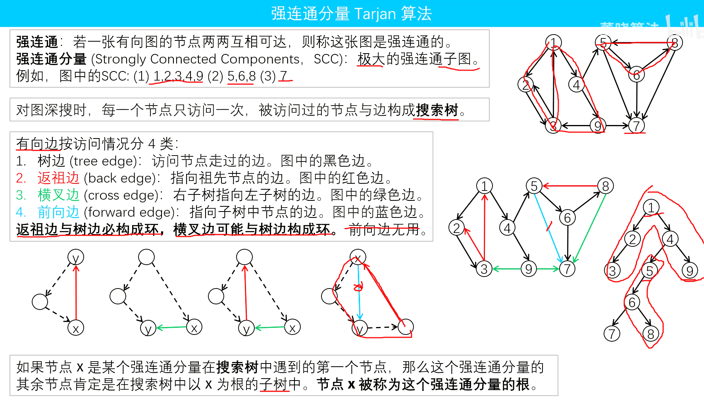


##### Tarjan SCC缩点


**校园网络**


##### 强连通分支


#### 双连通分量


#### 图的割边和割点

##### Tarjan割点


##### Tarjan割边


#### 2-SAT


### 最小生成树

#### 次小生成树


#### k小生成树


#### 最优比例生成树


### 最短路

#### 第k短路径


#### 差分约束


### 网络流

#### 最大流

##### EK算法


#### 最小割


### 二分图

#### 二分图判定


#### 匈牙利算法


#### KM算法

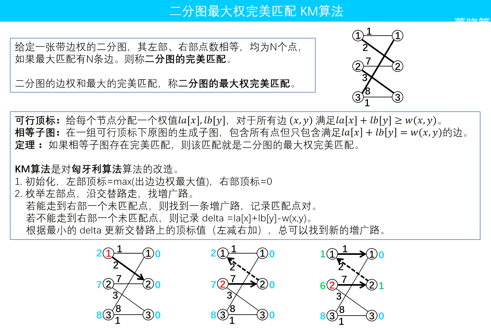


#### Dinic算法

二分图转为网络流模型


#### 最大独立集


### 欧拉回路


### 哈密顿回路


### 最小生成森林


### 稳定婚姻


### 仙人掌


### 带花树


### 斯坦纳树


### 支配树


### 基环树

#### 基环外向树


### 对偶图


### 最大团


### 树分治


## 数据结构

### 分块

#### 区间更新、单点查询

```
/**
 * @brief 区间更新，单点查询
 *  数据范围：1~n
 */
int n, len, id[N], lazy[N], data[N];

void add(int l, int r, int v) {
    for (int i = l; i <= std::min(id[l] * len, r); i++) {
        data[i] += v;
    }
    if (id[l] != id[r]) {
        for (int i = (id[r] - 1) * len + 1; i <= r; i++) {
            data[i] += v;
        }
    }
    for (int i = id[l] + 1; i <= id[r] - 1; i++) {
        lazy[i] += v;
    }
}

void solve() {
    len = std::sqrt(n);
    for (int i = 1; i <= n; i++) {
        id[i] = (i - 1) / len + 1; 
    }
    // data[i] + lazy[id[i]]
}
```


#### 区间更新、区间查询小于x的元素的个数

```
/**
 * @brief 区间更新，查询区间内小于x的元素的个数
 *  数据范围：1~n, M为sqrt(N)
 * 
 */
int len, id[N], lazy[N];
std::vector<int> bkt[M];
int n, d[N];

void reset(int x) {
    bkt[x].clear();
    for (int i = (x - 1) * len + 1; i < std::min(x * len, n); i++) {
        bkt[x].push_back(d[i]);
    }
    std::sort(bkt[x].begin(), bkt[x].end());
}

void add(int l, int r, int v) {
    for (int i = l; i < std::min(id[l] * len, r); i++) {
        d[i] += v;
    }
    reset(id[l]);
    if (id[l] != id[r]) {
        for (int i = (id[r] - 1) * len + 1; i <= r; i++) {
            d[i] += v;
        }
        reset(id[r]);
    }
    for (int i = id[l] + 1; i <= id[r] - 1; i++) {
        lazy[i] += v;
    }
}

int query(int l, int r, int v) {
    int res = 0;
    for (int i = l; i <= std::min(id[l] * len, r); i++) {
        if (d[i] + lazy[id[l]] < v) {
            res++;
        }
    }
    if (id[l] != id[r]) {
        for (int i = (id[r] - 1) * len + 1; i <= r; i++) {
            if (d[i] + lazy[id[r]] < v) {
                res++;
            }
        }
    }
    for (int i = id[l] + 1; i <= id[r] - 1; i++) {
        int x = v - lazy[i];
        res += std::lower_bound(bkt[i].begin(), bkt[i].end(), x) - bkt[i].begin();
    }
    return res;
}

void solve() {
    len = std::sqrt(n);
    for (int i = 1; i <= n; i++) {
        id[i] = (i - 1) / len + 1;
        bkt[id[i]].push_back(d[i]);
    }
    for (int i = 1; i <= id[n]; i++) {
        std::sort(bkt[i].begin(), bkt[i].end());
    }
}
```


#### 区间更新、区间查询小于x的最大值

```
/**
 * @brief 区间更新，查询区间小于x的最大值
 *  数据范围：1~n, M为sqrt(N)
 * 
 */
int len, id[N], lazy[N];
std::set<int> st[M];
int n, d[N];

void add(int l, int r, int v) {
    for (int i = l; i < std::min(id[l] * len, r); i++) {
        st[id[l]].erase(d[i]);
        d[i] += v;
        st[id[l]].insert(d[i]);
    }
    if (id[l] != id[r]) {
        for (int i = (id[r] - 1) * len + 1; i <= r; i++) {
            st[id[r]].erase(d[i]);
            d[i] += v;
            st[id[r]].insert(d[i]);
        }
    }
    for (int i = id[l] + 1; i <= id[r] - 1; i++) {
        lazy[i] += v;
    }
}

int query(int l, int r, int v) {
    int res = -1;
    for (int i = l; i <= std::min(id[l] * len, r); i++) {
        if (d[i] + lazy[id[l]] < v) {
            res = std::max(res, d[i] + lazy[id[l]]);
        }
    }
    if (id[l] != id[r]) {
        for (int i = (id[r] - 1) * len + 1; i <= r; i++) {
            if (d[i] + lazy[id[r]] < v) {
                res = std::max(res, d[i] + lazy[id[r]]);
            }
        }
    }
    for (int i = id[l] + 1; i <= id[r] - 1; i++) {
        auto it = st[i].lower_bound(v - lazy[i]);
        if (it == st[i].begin()) {
            continue;
        }
        res = std::max(res, *(--it) + lazy[i]);
    }
    return res;
}

void solve() {
    len = std::sqrt(n);
    for (int i = 1; i <= n; i++) {
        id[i] = (i - 1) / len + 1;
        st[id[i]].insert(d[i]);
    }
}
```


#### 区间更新、区间求和

```

```


### 链式前向星

```

```


#### 邻接矩阵


#### 边集数组


#### 邻接表

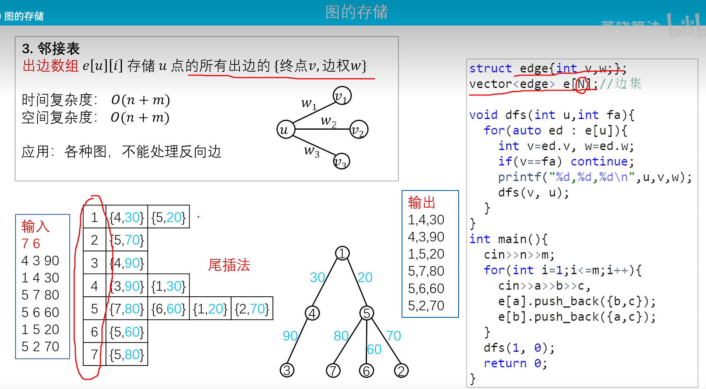


#### 链式邻接表

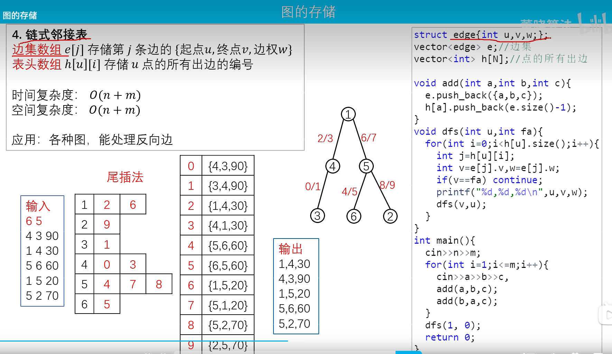


### bitset

```
bitset:
	any():
	count():
	flip():
	none():
	reset():
	set():
	size():
	to_string():
	to_ulong():
	to_ullong():
```


### 栈

#### 单调栈


### 队列

#### 优先队列


#### 双端队列


#### 单调队列

##### 滑动窗口最值


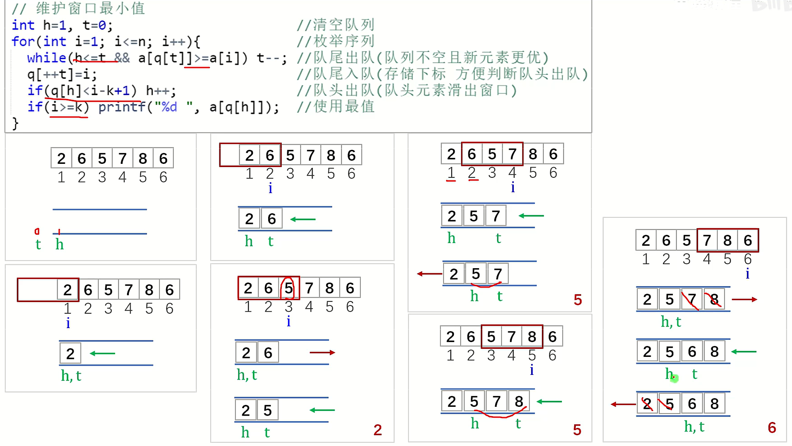


​	


### 堆


### 分治

#### CDQ分治

```
/*
	luogu P3810 三维偏序个数

*/

#include <iostream>
#include <algorithm>

const int N = 2e5 + 5;

struct node {
	int a, b, c, cnt, ans;
} s1[N], s2[N];

int n, k, cnt, m, c[N], ans[N];

// 树状数组
void add(int x, int y) {
    while (x <= k) {
        c[x] += y;
        x += x & (-x);
    }
}

int ask(int x) {
    int res =0;
    while (x > 0) {
        res += c[x];
        x -= x & (-x);
    }
    return res;
}

// CDQ分治
void cdq(int l, int r) {
    if (l == r) return;
    int mid = (l + r) >> 1;
    // 左边对左边收益、右边对右边收益
    cdq(l, mid);
    cdq(mid + 1, r);

    // 第二维排序
    auto cmp2 = [](const node& a, const node& b) {
        if (a.b == b.b) {
            return a.c < b.c;
        }
        return a.b < b.b;
    };
    std::sort(s2 + l, s2 + mid + 1, cmp2);
    std::sort(s2 + mid + 1, s2 + r + 1, cmp2);

    // 右边对左边收益（左边不可能对右边收益：左边第一维小）
    int j = l;
    for (int i = mid + 1; i <= r; i++) {
        while (s2[i].b >= s2[j].b && j <= mid) {
            add(s2[j].c, s2[j].cnt);
            j++;
        }
        s2[i].ans += ask(s2[i].c);
    } 
    for (int i = l; i < j; i++) 
        add(s2[i].c, -s2[i].cnt); // 清空
}


int main() {
    std::cin >> n >> k;
    for (int i = 1; i <= n; i++) 
        std::cin >> s1[i].a >> s1[i].b >> s1[i].c;


    auto cmp1 = [](const node& a, const node& b) {
        if (a.a == b.a) {
            if (a.b == b.b) return a.c < b.c;
            return a.b < b.b;
        }
        return a.a < b.a;
    };
    // 第一维排序
    std::sort(s1 + 1, s1 + 1 +n, cmp1);

    // 去除处理
    for (int i = 1; i <= n; i++) {
        cnt++;
        if (s1[i].a != s1[i + 1].a || s1[i].b != s1[i + 1].b || s1[i].c != s1[i + 1].c) {
            m++;
            s2[m] = s1[i];
            s2[m].cnt = cnt;
            cnt = 0;
        }
    }

    // CDQ分治
    cdq(1, m);

    for (int i = 1; i <= m; i++) {
        ans[s2[i].ans + s2[i].cnt - 1] += s2[i].cnt;
    }

    for (int i = 0; i < n; i++)
        std::cout << ans[i] << '\n';

	return 0;
}
```


### 树

#### 基环树


#### 二叉树


#### 二叉搜索树


#### 平衡树


#### 左偏树


### 线段树


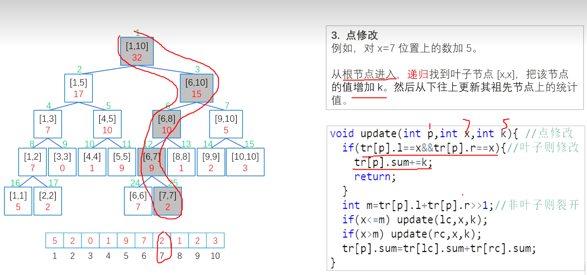


#### 离散线段树


#### 扫描线

```
#include <iostream>
#include <algorithm>

const int N = 1e7 + 5;

using ll = long long;

struct Line{
    int x, y1, y2;
    int flg; // 左1，右-1
    bool operator<(Line& b) {
        return x < b.x;
    }
} L[N * 2];

struct Tree {
    int l, r, len; // 区间有效高度
    int cnt;
} tr[N * 8];

int n, Y[N * 2];

void build (int u, int l, int r) {
     tr[u].l = Y[l];
     tr[u].r = Y[r];
     if (r == l + 1) return; // 叶子宽度为2
     int mid = (l + r) >> 1;
     build(u << 1, l, mid);
     build((u << 1) | 1, mid, r);
}

void pushup(int u) {
    if (tr[u].cnt) { // 第u号区间被完全覆盖
        tr[u].len = tr[u].r - tr[u].l;
    } else {    // 第u号区间未完全覆盖
        tr[u].len = tr[u << 1].len + tr[u << 1 | 1].len;
    }
}

void change(int u, int a, int b, int c) {
    if (a >= tr[u].r || b <= tr[u].l) return;
    if (a <= tr[u].l && tr[u].r <= b) {
        tr[u].cnt += c;
        pushup(u);
        return;
    }
    change(u << 1, a, b, c);
    change(u << 1 | 1, a, b, c);
    pushup(u);
}

int main() {
    std::cin >> n;
    int x1, x2, y1, y2;
    for (int i = 1; i <= n; i++) {
        std::cin >> x1 >> y1 >> x2 >> y2;
        L[i] = { x1, y1, y2, 1};
        L[n + i] = { x2, y1, y2, -1};
        Y[i] = y1;
        Y[n + i] = y2;
    }
    n *= 2;
    std::sort(L + 1, L + n + 1); // 按照x从小到大排序
    std::sort(Y + 1, Y + 1 + n);
    build(1, 1, n); // Y中n的个数还可优化
    ll ans = 0;
    for (int i = 1; i < n; i++) {
        change(1, L[i].y1, L[i].y2, L[i].flg);
        ans += 1ll * (L[i + 1].x - L[i].x) * tr[1].len;
    }
    std::cout << ans << '\n';
    return 0;
}
```


区间有效高度思想


#### zkw线段树


#### 线段树合并


### 李超树


### 主席树


### ST表

#### 区间最值

```
/**
 * @brief ST表（区间最大、小值查询，不能更新）
 * 区间范围：1~n，2^21=2e6
 */
int n, d[N], mx[N][22], mn[N][22];

int get_max(int l, int r) {
    int k = std::log2(r - l + 1);
    return std::max(mx[l][k], mx[r - (1 << k) + 1][k]);
}

int get_min(int l, int r) {
    int k = std::log2(r - l + 1);
    return std::min(mn[l][k], mn[r - (1 << k) + 1][k]);
}

void init() {
    for (int i = 1; i <= n; i++) {
        mx[i][0] = mn[i][0] = d[i]; 
    }
    // 长度递推
    for (int j = 1; j <= 21; j++) {
        for (int i = 1; i + (1 << j) - 1 <= n; i++) {
            mx[i][j] = std::max(mx[i][j - 1], mx[i + (1 << (j - 1))][j - 1]);
            mn[i][j] = std::min(mn[i][j - 1], mn[i + (1 << (j - 1))][j - 1]);
        }
    }
}
```


### 树状数组


#### 单点更新、区间求和

```
/**
 * @brief 树状数组（单点更新，区间求和）
 *  数据范围：1~n 
 * 
 */
int n, arr[N], bit[N];

int sum(int i) {
    int res = 0;
    while (i > 0) {
        res += bit[i];
        i -= i & -i;
    }
    return res;
}

void add(int i, int v) {
    while (i <= n) {
        bit[i] += v;
        i += i & -i;
    }
}

void init() {
    for (int i = 1; i <= n; i++) {
        add(i, arr[i]);
    }
}
```


#### 区间更新、单点求和

```
/**
 * @brief 树状数组（区间更新，单点查询）
 *	数组拆分：区间[1~i]求和为a[i]
 *  数据范围：1~n
 * 
 */
int n, arr[N], bit[N];

int sum(int i) {
    int res = 0;
    while (i > 0) {
        res += bit[i];
        i -= i & -i;
    }
}

void add(int i, int v) {
    while (i <= n) {
        bit[i] += v;
        i += i & -i;
    }
}

void update(int l, int r, int v) {
    add(l, v);
    add(r + 1, -v);
}

void init() {
    for (int i = 1; i <= n; i++) {
        add(i, arr[i] - arr[i - 1]);
    }
}
```


#### 区间更新、区间查询

```
/**
 * @brief 树状数组（区间更新，区间查询）
 *	拆分思想
 *  数据范围：1~n，bit[i][0]为公式前面，bit[i][1]为公式后面
 *     arr[1~3]：
 *        (3+1)*(c[1]+c[2]+c[3])   -   (1*c[1]+2*c[2]+3*c[3])
 *		c[1] 
 *		c[1] + c[2]
 *		c[1] + c[2] + c[3]
 *
 * 
 */
int n, arr[N], bit[N][2];

int sum(int i, int f) {
    int res = 0;
    while (i > 0) {
        res += bit[i][f];
        i -= i & -i;
    }
}

void add(int i, int v, int f) {
    while (i <= n) {
        bit[i][f] += v;
        i += i & -i;
    }
}

void update(int l, int r, int v) {
    add(l, v, 0);
    add(r + 1, -v, 0);
    add(l, l * v, 1);
    add(r + 1, (r + 1) * -v, 1);
}

int query(int i) {
    return (i + 1) * sum(i, 0) - sum(i, 1);
}

void init() {
    for (int i = 1; i <= n; i++) {
        add(i, arr[i] - arr[i - 1], 0);
        add(i, i * (arr[i] - arr[i - 1]), 1);
    }
}
```


#### 单点更新、区间最值

```
/**
 * @brief 树状数组（单点更新，区间最值）
 *  数据范围：1~n，这里算的是max，最小值只需把max换成min即可
 *     7(111)   6(110)      4(100)
 *              5(101)   2(010) 3(011)
 *                       1(001)
 */
int n, arr[N], bit[N];

void update(int i) {
    while (i <= n) {
        bit[i] = arr[i];
        int x = i & -i;
        for (int j = 1; j < x; j++) {
            bit[i] = std::max(bit[i], bit[i - j]);
        }
        i += x;
    }
}

int query(int l, int r) {
    int res = 0;
    while (r >= l) {
        res = std::max(res, arr[r]);
        r--;
        while (r - (r & -r) >= l) {
            res = std::max(res, bit[r]);
            r -= r & -r;
        }
    }
    return res;
}

void init() {
    for (int i = 1; i <= n; i++) {
        update(i);
    }
    // 更新arr[1]
    arr[1] = 100;
    update(1);
}
```


### 树链剖分

#### 最近公共祖先


#### 树上修改、查询


### 字典树

#### 可持续化字典树


### 并查集


#### 带权并查集


#### 可持续化并查集


### Splay

#### Treap

#### FHQ Treap


### LCT


### 替罪羊树


### 莫队

#### 带修莫队


### 树套树


### 舞蹈链


### 笛卡尔树


### 猫树


### KD树


## 数论

### 快速幂


### 贝祖定理


裴蜀定理

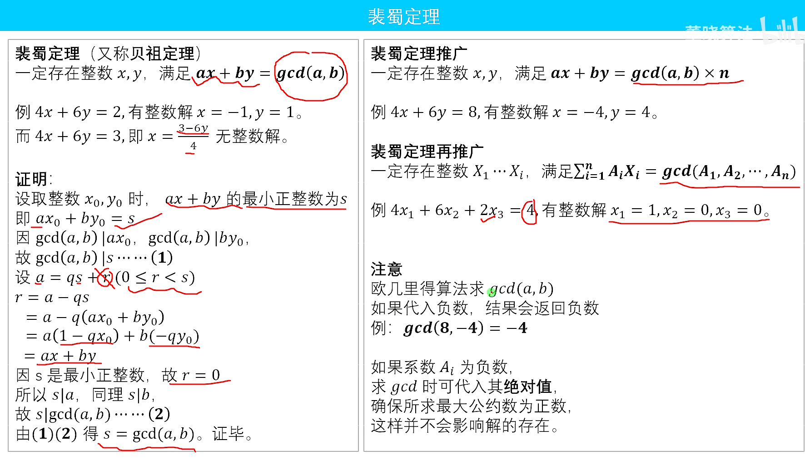


### 欧几里得

```
int gcd(int a, int b) {
	if (0 == b) return a;
	return gcd(b, a % b);
}
```


#### 类欧几里得


#### 扩展欧几里得


### 母函数


### 泰勒展开


### 康托展开


### 同余

#### 逆元

扩展欧几里得求乘法逆元


#### 指数同余方程


#### 高次同余方程


### 二次剩余


### 威尔逊定理


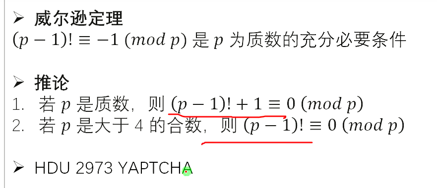


### 欧拉定理


#### 扩展欧拉定理


### 中国剩余定理


#### 扩展中国剩余定理


### 素性测试

#### 试除法


#### 唯一分解定理


#### 约数个数筛法


#### 约数和筛法


### 素数筛

#### 埃氏筛


#### 线性欧拉筛

保证合数只被最小质因数去除


#### 杜教筛


#### Min25筛


#### 洲阁筛


### Miller-Rabin素数测试


### Pollard-Rho大数分解


### 素数密度定理


### BSGS


#### EXBSGS


### 原根


### 费马小定理


### 卢卡斯定理


### 积性函数

#### 积性函数前缀和


### 欧拉函数


#### 线性筛


### 莫比乌斯函数

#### 线性筛


#### 莫比乌斯反演


### 迪利克雷卷积


### 整除分块


#### 合式变化


### FFT

#### NTT


#### FWT


#### 生成函数


### 线性基


### 高斯消元

#### 线性方程组


#### 矩阵求逆


## 字符串

### 字典树

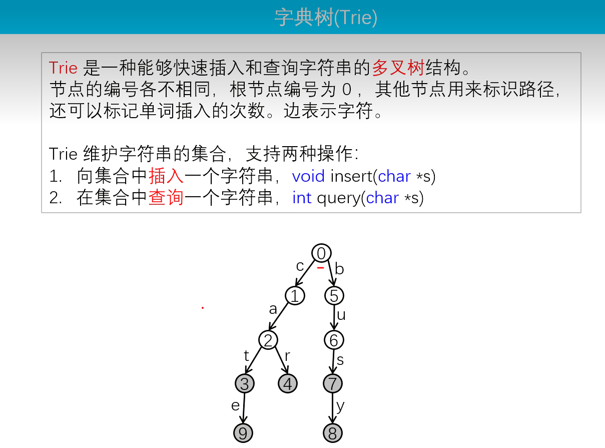


#### 01字典树


### KMP


相同前后缀的最大长度


#### 扩展KMP


### 哈希


#### 最小表示法


### 后缀自动机


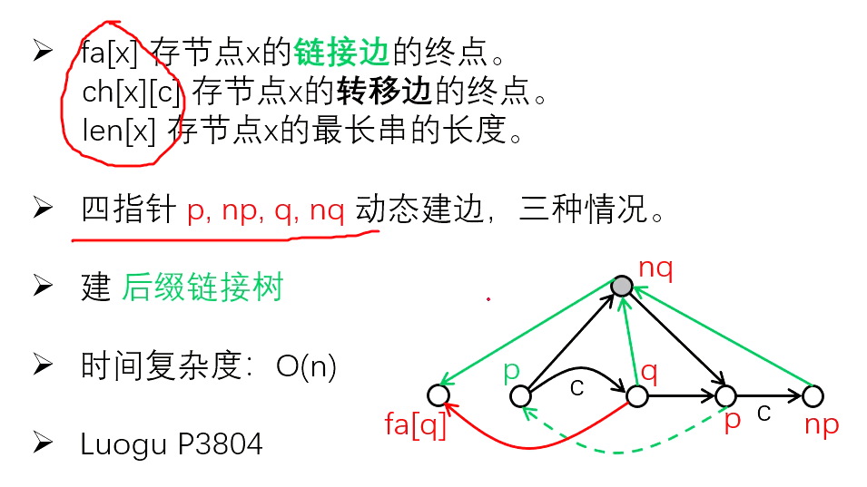


#### 广义后缀自动机


### 马拉车


### AC自动机

基于字典树、构造类似KMP


沿着回跳边寻找所有匹配的后缀字符串


### 回文自动机


### 后缀数组

相邻后缀的最长公共前缀长度


### Lyndon分解


### BM算法


## 动态规划

### 一般DP

#### LCS

##### 最长公共子序列


 


##### 最长公共子串

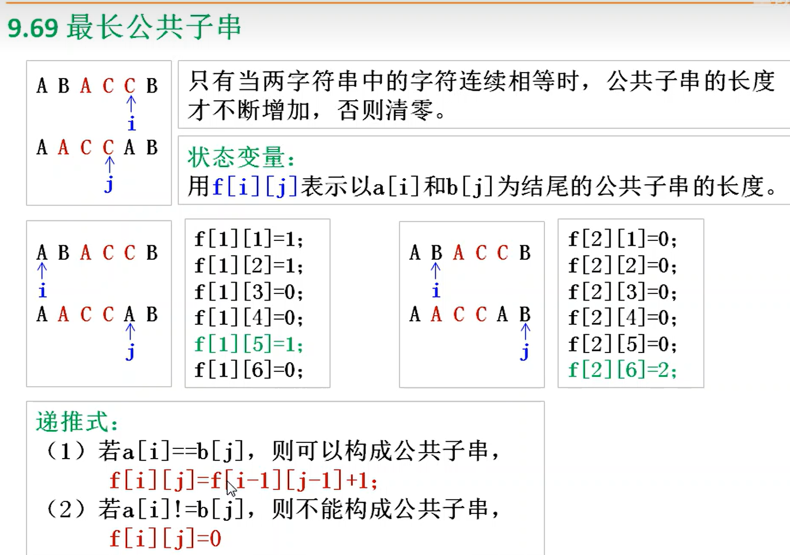


#### 编辑距离


  


滚动数组优化


### 背包问题

#### 01背包


#### 完全背包


#### 多重背包


##### 二进制优化


### 区间DP

#### 石子合并


### 状态压缩DP

#### 玉米田


### 数位DP

#### Windy数


### 树形DP

#### 没有上司的舞会


### 概率DP


### 插头DP


### SOSDP


### DP优化


## 组合数学

### 排列

#### 多重集和排列


### 组合

#### 多重集的组合


#### 组合数公式


#### 快速幂求组合数

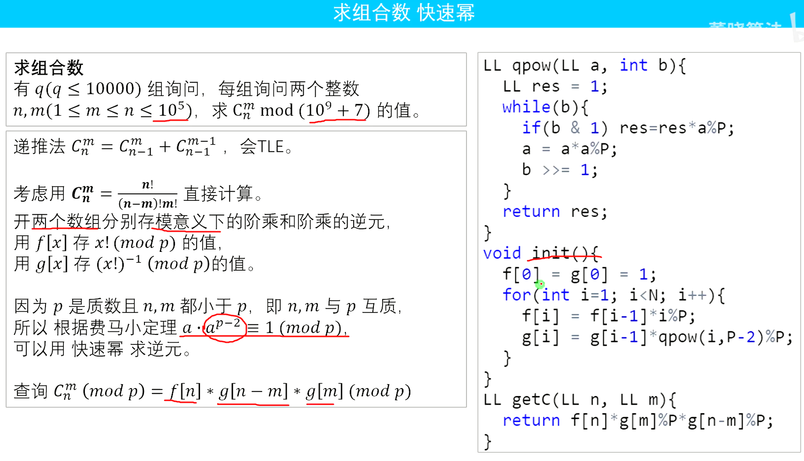


#### 卢卡斯定理


#### 线性筛求组合数


#### 隔板法


### 二项式定理


### 鸽巢原理


### 容斥原理

#### 集合的并

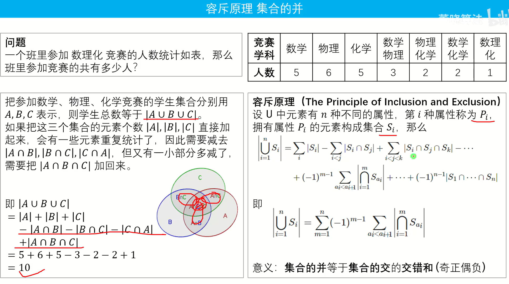


#### 集合的交


### 错排问题


### 特殊计数

#### 斐波那契数列


#### 卡特兰数


#### 第一类斯特林数


#### 第二类斯特林树


### 生成函数


#### 普通生成函数


#### 指数生成函数


### 线性递推方程

#### 非线性递推方程


### Burnside定理


### Polya计数


## 计算几何

### 最远曼哈顿距离


### 最小包围圆

#### 最小包围球


### 最远点对

#### 旋转卡壳


#### 最近点对


#### 最近圆对


### 费马点


### 圆交点

#### 圆的面积交


### 平面面积最大三角


### Pick定理


### 多边形面积

#### 重心


### 多边形判核


### 模拟退火


### 定长圆覆盖最多的点


### 不等大的圆的圆弧表示


### 矩形面积并

#### 矩形的周长并


### 圆的反演变换


## 博弈论

### 巴什博弈


### 威佐夫博弈


### Nim博弈


### SG函数


### 斐波那契博弈


### 其它博弈


## 其它

### 排序

#### 冒泡排序


#### 选择排序


#### 快速排序


#### 堆排序


#### 桶排序


#### 归并排序


#### 插入排序


### 贪心


### 尺取


### 前缀和


### 滚动数组


### 差分


### 二分

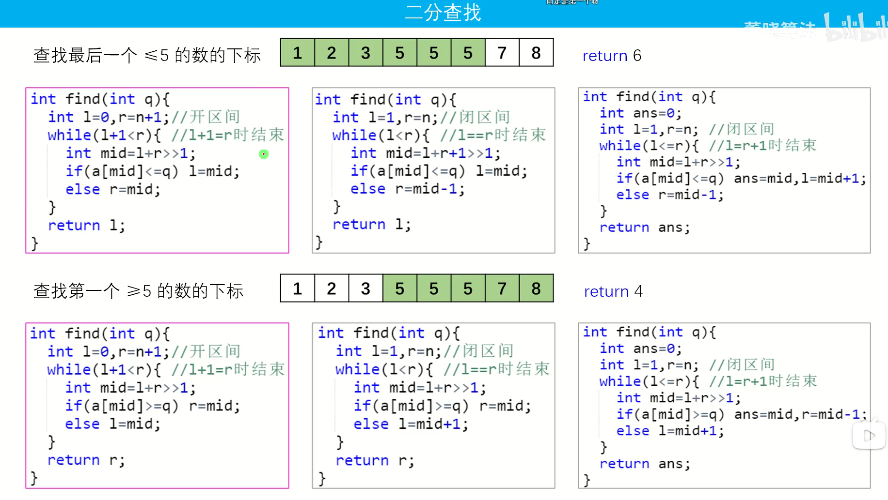


开区间模板


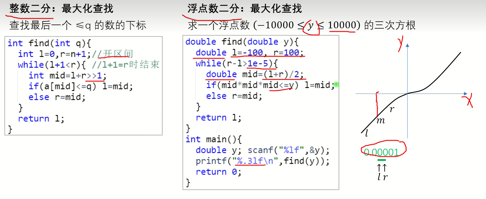


#### 三分


### 扫描线


### 高精度


### 倍增


### 构造


### 交互


### 快读


### 扩栈


### STL


